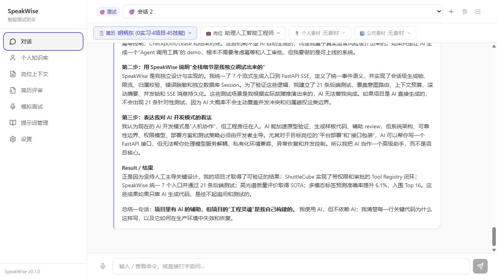
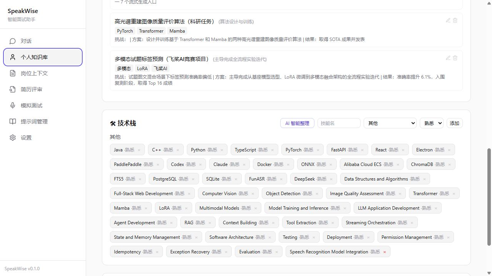
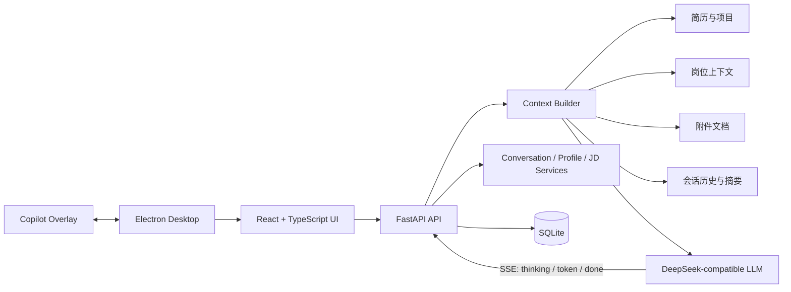

# SpeakWise

> 面向求职与面试场景的智能面试助手：把个人简历、项目经历、目标岗位和自定义提示词组织成可复用的知识上下文，为对话辅导、模拟面试和回答优化提供个性化支持。

[](https://react.dev/)
[](https://fastapi.tiangolo.com/)
[](https://www.electronjs.org/)
[](https://www.python.org/)

SpeakWise 是一个以真实个人经历为上下文的 Interview Copilot。它不仅生成面试回答，还围绕简历、岗位 JD、项目素材和对话历史构建完整的知识注入链，并通过 SSE 持续呈现思考和回答过程。

## 项目截图

### AI 对话与面试辅导



### 个人知识库与技术栈管理



## 项目亮点

- **个人知识库驱动回答**：整合多份简历、实习经历、项目、附件文档和岗位 JD，让回答尽量基于真实经历，而不是泛化模板。
- **跨页面流式任务保留**：对话生成期间切换页面不会中断任务，返回后可继续查看实时思考和正文输出。
- **统一 SSE 流式协议**：后端统一输出元数据、思考过程、正文片段、完成与错误事件，前端集中消费并持久化最终消息。
- **固定技术栈体系与 AI 整理**：将技能归入编程语言、前端、后端、AI 算法、Agent/LLM、DevOps、软件工程等类别；现有技能必须先预览、确认后才批量保存。
- **双模式模型路由**：面试模式使用完整知识库和面试意图分类；普通模式根据问题内容选择主模型或快速模型。
- **桌面提词器**：Electron 提供透明置顶的 Copilot Overlay，可调整位置、尺寸、透明度、滚动速度和字号。
- **可靠性边界**：包含会话级生成锁、并发控制、请求限流、资源归属校验、错误脱敏和独立数据库 Session。

## 主要功能

| 模块 | 能力 |
|---|---|
| AI 对话 | 普通对话 / 面试辅导双模式、SSE 流式生成、思考过程展示、Markdown 与公式渲染 |
| 个人知识库 | 多简历切换、基础信息、实习与项目管理、PDF / DOCX / TXT 导入解析 |
| 技术栈 | 固定 8 类分组、手动分类、AI 智能整理、预览后确认保存 |
| 岗位上下文 | JD 解析、核心技能 / 职责 / 文化价值提取、会话岗位绑定 |
| 简历评审 | 基于目标岗位分析简历匹配度与改进方向 |
| 模拟面试 | 面试问答训练、语音输入、面试模式知识库注入 |
| 提示词管理 | 内置模板、默认模板切换、复制副本、JSON 导入导出 |
| 桌面端 | Electron 应用、透明置顶提词器、设置持久化 |

## 系统架构



核心上下文链路：

```text
结构化简历 + 技术栈 + 附件文档 + JD 关键词 + 会话历史
                         ↓
                  ContextBuilder
                         ↓
              模型路由与提示词模板
                         ↓
             SSE 思考过程与回答正文
```

## 技术栈

| 层级 | 技术 |
|---|---|
| 前端 | React 18.3、TypeScript、Vite 5、Tailwind CSS 3.4、TanStack Query |
| 内容渲染 | React Markdown、KaTeX、Highlight.js、GitHub Flavored Markdown |
| 后端 | Python 3.12、FastAPI、SQLModel、Pydantic、Uvicorn |
| 数据与传输 | SQLite、Server-Sent Events、HTTPX |
| LLM | DeepSeek-compatible API、主模型 / 快速模型路由、reasoning content |
| 文档解析 | pypdf、python-docx、纯文本导入 |
| 桌面端 | Electron 43、Preload IPC、透明置顶窗口 |
| 测试 | Pytest、Vitest、Testing Library、JSDOM |

## 快速开始

### 环境要求

- Python `3.12.x`
- Node.js `20+`
- [uv](https://docs.astral.sh/uv/)
- DeepSeek 或兼容 OpenAI API 协议的模型服务

### 1. 克隆项目

```powershell
git clone https://github.com/Zoe-Well/SpeakWise.git
cd SpeakWise
```

### 2. 安装依赖

```powershell
uv sync --dev

cd frontend
npm install
cd ..
```

### 3. 配置模型

复制环境变量模板：

```powershell
Copy-Item .env.example .env
```

在 `.env` 中填写 API Key：

```dotenv
DEEPSEEK_API_KEY=your_deepseek_api_key_here

# 可选
# LLM_MODEL=deepseek-v4-pro
# LLM_FAST_MODEL=deepseek-chat
# LLM_BASE_URL=https://api.deepseek.com/v1
```

`.env` 已被 Git 忽略。也可以启动应用后在“设置”页面配置模型服务。

### 4. 启动浏览器开发版

终端 1：

```powershell
uv run uvicorn backend.src.main:app --host 127.0.0.1 --port 8001 --reload
```

终端 2：

```powershell
cd frontend
npm run dev
```

访问：

- 前端：<http://localhost:5173>
- API 文档：<http://127.0.0.1:8001/docs>
- 健康检查：<http://127.0.0.1:8001/api/health>

Windows 也可以直接运行：

```powershell
./start.ps1
```

### 5. 启动 Electron 桌面版

开发模式需要先保持 Vite 前端运行。首次使用先安装 Electron 目录依赖：

```powershell
cd electron
npm install
cd ..
```

然后从项目根目录启动：

```powershell
$env:NODE_ENV="development"
./electron/node_modules/.bin/electron.cmd .
```

Electron 会使用根目录 `main.js` 并自动启动 `8001` 端口的后端。更完整的启动说明见 [start.md](start.md)。

## 环境配置

| 环境变量 | 必需 | 默认值 | 说明 |
|---|---:|---|---|
| `DEEPSEEK_API_KEY` | 是 | — | 模型服务 API Key |
| `LLM_MODEL` | 否 | `deepseek-v4-pro` | 面试模式主模型 |
| `LLM_FAST_MODEL` | 否 | `deepseek-chat` | 普通问题快速模型 |
| `LLM_BASE_URL` | 否 | `https://api.deepseek.com/v1` | OpenAI-compatible API 地址 |
| `VITE_API_URL` | 否 | `http://127.0.0.1:8001` | 前端连接的后端地址 |
| `SPEAKWISE_DATA_DIR` | 否 | 项目 `data/` | 数据库与桌面设置目录 |

## 测试与质量保障

后端测试覆盖上下文预算、意图分类、会话并发锁、SSE 持久化、数据库迁移和技能智能分类；前端测试覆盖页面状态保留、跨页面流式输出和技术栈预览确认交互。

```powershell
# 后端测试
uv run pytest backend/tests -q

# 前端测试与正式构建
cd frontend
npm test
npm run build
```

当前回归基线：

- 后端：`38 passed`
- 前端：`16 passed`
- 前端正式构建：通过

## 项目结构

```text
SpeakWise/
├── main.js                    # Electron 根入口
├── backend/
│   ├── src/
│   │   ├── api/               # FastAPI 路由
│   │   ├── services/          # 对话、简历、上下文与分类服务
│   │   ├── llm/               # 模型客户端与路由
│   │   ├── models/            # SQLModel 数据模型
│   │   └── prompts/           # 面试提示词
│   └── tests/                 # 单元与集成测试
├── frontend/
│   └── src/
│       ├── pages/             # 业务页面
│       ├── components/        # 对话、导入、弹窗与通知组件
│       └── lib/               # API、流消费与共享逻辑
├── electron/                  # 桌面辅助文件与提词器
├── data/                      # 本地数据库与桌面设置
├── docs/                      # 架构、设计与项目资料
└── specs/                     # 功能规格与 API 契约
```

## 当前状态与后续方向

SpeakWise 当前以单用户、本地优先的面试辅助工作流为核心，主要能力已经覆盖简历知识库、岗位分析、流式对话、模拟面试、模板管理和桌面提词器。

后续可继续探索：

- 面试表现评估与长期能力趋势
- 更多模型供应商和本地模型适配
- 更完整的桌面安装包与自动更新流程
- 在明确权限边界后的多端同步

## 相关文档

- [项目启动说明](start.md)
- [构建与打包](BUILD.md)
- [部署说明](DEPLOY.md)
- [项目介绍](docs/项目介绍.md)
- [Agent 核心技术实现](docs/Agent核心技术实现文档.md)

## Repository

[github.com/Zoe-Well/SpeakWise](https://github.com/Zoe-Well/SpeakWise)
