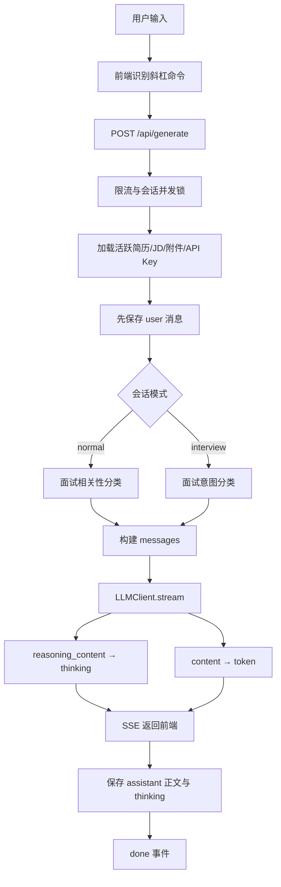
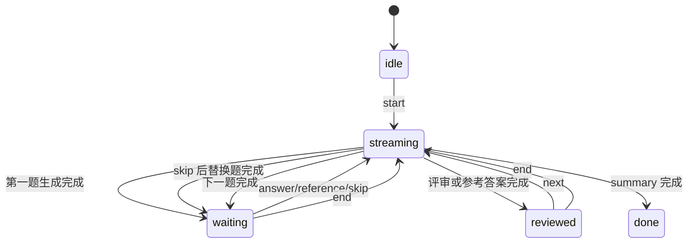

# SpeakWise Agent 核心技术实现文档

> 更新时间：2026-07-27
> 文档基线：2026-07-26 当前工作区源码
> 分析范围：对话生成、模拟面试、简历/JD 知识库、提示词模板、模型调用、SSE、状态与记忆
> 说明：本文描述的是代码中已经存在的实现，不把规划能力当作已实现能力。

## 1. 核心结论

SpeakWise 当前不是一个会自主规划并调用任意工具的通用 Agent，而是一个面向面试场景的、受控编排型 Interview Copilot。它的核心实现可以概括为：

```text
领域提示词
  + 规则意图分类与显式命令
  + 简历/JD/附件的确定性上下文注入
  + SQLite 会话与知识记忆
  + 固定工作流状态机
  + OpenAI 兼容模型抽象
  + SSE 双通道流式输出
```

系统没有实现以下典型通用 Agent 机制：

- 没有 ReAct 或 Plan-and-Execute 循环；
- 没有由模型决定下一步动作的 Agent Executor；
- 没有 OpenAI function calling / tool calling schema；
- 没有向量数据库、Embedding、相似度检索或重排序；
- 没有自动压缩、反思、事实抽取式的长期记忆；
- 没有多 Agent 协作。

因此，准确的架构定位应是：**LLM 驱动的领域 Copilot + 确定性工作流**，而不是“自主工具型 Agent”。

## 2. 总体架构

### 2.1 分层结构

| 层级 | 核心职责 | 主要实现 |
|---|---|---|
| 交互层 | 输入、命令识别、流式展示、局部 UI 状态 | `frontend/src/pages/ConversationPage.tsx`、`InterviewPage.tsx` |
| API 编排层 | 请求校验、知识加载、路由、流式事件、落库 | `backend/src/api/generate.py`、`interview.py`、`review.py` |
| Agent 服务层 | 意图分类、上下文构建、模板加载、消息编排 | `backend/src/services/conversation_service.py` |
| Prompt 层 | 角色、约束、输出结构、领域策略 | `backend/src/prompts/` |
| 模型适配层 | OpenAI 兼容调用、模型覆盖、reasoning/token 拆分 | `backend/src/llm/client.py` |
| 记忆与状态层 | 会话、消息、简历、JD、附件、模板持久化 | `backend/src/models/`、SQLite |

### 2.2 普通对话主链路



对应的主要入口是：

- `backend/src/api/generate.py::generate()`：API 级总编排；
- `backend/src/services/conversation_service.py::handle_message()`：对话模式、意图和 Prompt 路由；
- `backend/src/llm/client.py::stream()`：底层模型流式调用；
- `frontend/src/lib/streamConsumer.ts::consumeGenerateStream()`：前端事件累积；
- `frontend/src/pages/ConversationPage.tsx::handleSend()`：UI 状态与请求生命周期。

## 3. 提示词设计

### 3.1 分层 Prompt 结构

项目没有使用单个超长 Prompt，而是按任务拆成三层：

1. **角色与不可违反约束**：放在 `system` 消息中；
2. **输出结构与风格控制**：内置控制模板或用户模板规则；
3. **事实上下文与当前任务**：放在最终 `user` 消息中。

以自我介绍为例，最终 messages 结构为：

```python
[
    {"role": "system", "content": SYSTEM_ROLE},
    {"role": "system", "content": USER_CONTROL_TEMPLATE},
    {"role": "user", "content": "简历 + JD + 模板覆盖规则"},
]
```

这种设计将“身份/安全边界”“回答格式”“业务事实”分开，便于维护和按任务复用。

### 3.2 领域 Prompt 路由

当前对话 Agent 有四类核心生成策略：

| 路由 | Prompt 构造器 | 关键策略 | 温度 |
|---|---|---|---:|
| `/intro` | `build_intro_messages()` | 300–400 字、1–2 分钟、概述/能力/业务匹配 | 0.4 |
| `/scenario` | `build_scenario_messages()` | STAR、真实经历锚定、至少 3 个行动步骤、语气自适应 | 0.4 |
| `/technical` | `build_technical_messages()` | 理解题意/思路/代码/测试/追问五段式 | 0.4 |
| `/followup` | `handle_message()` 内联构建 | 结合背景和最近对话，仅输出一个挑战性追问 | 0.6 |
| 通用面试问答 | `handle_message()` 内联构建 | 完整知识库、基于历史迭代、具体且有针对性 | 0.5 |
| 普通通用问答 | `handle_message()` 内联构建 | 中性助手、简洁直接、快速模型 | 0.5 |

Prompt 文件分别位于：

- `backend/src/prompts/self_intro.py`；
- `backend/src/prompts/scenario.py`；
- `backend/src/prompts/technical.py`；
- `backend/src/prompts/interview.py`；
- `backend/src/prompts/resume_review.py`；
- `backend/src/prompts/job_analysis.py`。

### 3.3 事实约束与幻觉抑制

自我介绍、场景题和技术题 Prompt 都强调：

- 必须基于用户提供的真实经历和技能；
- 不得编造无关工作经历或技术经历；
- 优先引用简历、项目、实习、岗位要求和附件材料；
- 多轮请求应在历史答案上迭代，而不是机械重写。

这是一种 **Prompt 级 grounding**。它能降低幻觉，但不是强约束：系统没有在生成后执行事实一致性校验，也没有建立“答案句子 → 来源记录”的引用映射。

### 3.4 用户可配置模板

`PromptTemplate` 保存：

- `scope`：`self_intro | scenario | technical`；
- `structure_rules`：JSON 结构规则；
- `style_rules`：JSON 风格规则；
- `is_builtin`：是否为内置模板。

`TemplateDefault` 的表结构保存每个 `profile_id + scope` 的默认模板选择。生成时：

```text
有效命令/分类结果
  → 映射 scope
  → 查询当前活跃 profile 的 TemplateDefault
  → 加载 PromptTemplate
  → JSON 反序列化
  → 追加到任务上下文
```

默认模板优先于请求中的 `template_id`；只有找不到 scope 默认模板时，才回退到传入的模板 ID。

模板默认值 API 和生成时模板加载均使用 `get_active_profile()`，因此多简历场景下会跟随当前活跃简历切换。

模板导入与创建会调用 `_validate_template_rules()`：要求规则为 JSON 对象，限制顶层字符串值长度为 500 字符，并拦截部分英文 Prompt 注入短语。内置模板不可直接编辑，编辑时采用 copy-on-edit 创建副本。

需要注意：模板规则最后仍以字符串形式拼入 Prompt，并不是结构化解码约束；注入检测也只是有限关键词黑名单，不能视为完整的 Prompt Injection 防护。

## 4. 上下文构建

### 4.1 上下文数据源

每次生成前，`build_profile_data_for_prompt()` 从当前活跃简历关联的数据中组装：

```text
UserProfile
  ├─ name
  ├─ Internship[]
  │    └─ company / position / achievements
  ├─ Project[]
  │    └─ name / role / tech_stack / challenge / solution / result
  ├─ Skill[]
  │    └─ category / name / proficiency
  ├─ SourceDocument[] scope=profile, usage=attach, is_active=true
  └─ SourceDocument[] scope=jd, usage=attach, is_active=true

当前 profile 下 is_active=true 的 JobContext
  └─ core_skills / duties / culture_values
```

附件的完整提取文本最多可在数据库保存 50,000 字符。注入阶段由 `ContextBuilder` 按类别总预算裁剪，而不是给每个附件各分配一份上限：结构化简历 6,000 字符、JD 2,500、个人附件合计 5,000、公司/JD 附件合计 3,000、滚动摘要 2,000、近期历史合计 6,000。多个附件会在类别预算内分配空间。JD 解析输入和简历 LLM 解析输入仍分别截取前 8,000 字符。

### 4.2 上下文格式化

自由问答通过 `_build_free_text_context()` 生成带明确分区标签的文本：

```text
【用户简历】
姓名、实习、项目、技能

【目标岗位信息】
核心技能、主要职责、文化价值观

【附加个人素材-文件名】
附件正文

【附加公司素材-文件名】
附件正文

【对话历史】
历史消息

【当前问题】
用户输入
```

自我介绍、场景题和技术题则使用各自的格式化函数，将同一份 `profile_data` 变成适合任务的上下文。

### 4.3 这不是严格意义上的 RAG

当前实现更准确的名称是 **确定性知识注入**，而不是典型检索增强生成（RAG）：

| 能力 | 当前实现 |
|---|---|
| 数据切块 | 无语义切块，按字段及附件类别总字符预算裁剪 |
| Embedding | 无 |
| 向量索引 | 无 |
| 按问题检索 | 无，所有活跃结构化数据与附件片段直接注入 |
| 重排序 | 无 |
| 来源引用 | 仅有分区/文件名标签，无答案级引用 |

优点是实现简单、结果可预测、个人知识库较小时召回稳定；缺点是附件增多后 Token 成本线性增长，且真正相关的信息可能位于被截断部分。

### 4.4 JD 与附件的激活机制

- 简历：同一时间只有一个 `UserProfile.is_active=True`；
- JD：同一活跃简历下通过 API 保持一个活跃 JD，也允许全部停用；
- 附件：`SourceDocument.is_active` 支持多选；
- 生成链路实际读取的是“当前活跃简历 + 当前活跃 JD + 所有已激活 attach 文档”。

JD 已明确采用简历级全局状态：所有对话、模拟面试和评审链路都通过 `ContextBuilder.load_active_jd()` 读取当前 profile 下 `is_active=True` 的 `JobContext`，会话模型不再保留 JD 绑定字段。

## 5. 工具设计

### 5.1 当前的“工具”是什么

SpeakWise 没有向模型暴露 function/tool schema。所谓工具能力由前端动作和后端确定性路由实现，可以分为两类：

1. **对话命令工具**：`/intro`、`/scenario`、`/technical`、`/followup`；
2. **模拟面试动作工具**：`start`、`answer`、`reference`、`skip`、`next`、`summary`。

模型只负责在选定 Prompt 下生成内容，不负责选择或执行后端函数。这降低了不可控行为和工具误调用风险，也让桌面面试场景的延迟更稳定。

### 5.2 显式命令与自动意图识别

前端用正则识别消息开头的斜杠命令：

```regex
^\/(intro|scenario|followup|technical)\b
```

后端再次根据 `command` 路由。如果面试模式没有显式命令，则使用混合分类：

```text
显式 / 命令优先
  ↓
计算 intro / technical / scenario 加权分数
  ↓
高分且与第二名差距明确：直接路由
  ↓ 否
短追问：继承最近一次面试题型
  ↓ 无可继承
快速模型输出结构化 intent + confidence
  ↓ 低置信或失败
通用面试问答
```

宽泛疑问词不再单独触发技术题。明确输入保持规则路由的低延迟，只有歧义输入增加一次快速模型调用；同一次生成只计算一次意图并传给模板选择和消息路由。

### 5.3 普通模式的模型路由

普通模式使用 `classify_message()` 检查中英文面试/求职关键词：

- 命中：使用当前主模型，并注入简历/JD/历史；
- 未命中：使用 `FAST_MODEL`，默认 `deepseek-chat`，只带最近历史和简洁助手 Prompt。

面试模式始终使用当前主模型，默认 `deepseek-v4-pro`。

### 5.4 结构化解析工具

系统还包含两个非流式 LLM 工具：

- JD 解析：把原始 JD 转为 `core_skills / duties / culture_values` 严格 JSON；
- 简历解析：把附件文本转为 profile、internship、project、skill 更新建议。

简历解析不会直接改知识库，而是先生成 `ProfileUpdateProposal`，用户确认选中的 change 后才合并。这是一个重要的人机协作安全边界。

## 6. 流程编排

### 6.1 对话生成编排

`POST /api/generate` 的执行顺序是：

1. 解析 `session_id/content/command/template_id`；
2. 检查 30 秒窗口内每会话最多 10 次请求；
3. 检查同一会话是否已有生成任务；
4. 从数据库加载活跃 API Key、Provider、模型并重配全局 LLM 客户端；
5. 加载活跃简历、结构化经历、附件和活跃 JD；
6. **先将用户消息写入 SQLite**；
7. 发送 `meta` 和一段系统上下文摘要形式的 `thinking`；
8. 调用 `handle_message()` 选择模型、Prompt 和上下文；
9. 把模型原生 `reasoning_content` 作为 `thinking` SSE 事件；
10. 把模型正文 `content` 作为 `token` SSE 事件；
11. 累积完整正文与 thinking，保存 assistant 消息；
12. 发送 `done`；
13. 在 `finally` 中释放会话生成锁。

SSE 协议实际包含：

| 事件 | 数据 | 用途 |
|---|---|---|
| `meta` | command、session_id、session_mode | 请求元信息 |
| `thinking` | 系统摘要或模型 reasoning 增量 | 思考面板 |
| `token` | 回答正文增量 | 实时回答 |
| `done` | content、length，部分接口含 session_id | 完成与最终结果 |
| `error` | 用户可读错误 | 失败反馈 |

### 6.2 模拟面试状态机

模拟面试使用独立 API 和前端状态机，而不是复用 `/api/generate`：



后端按动作选择固定 Prompt：

- `start`：基于简历/JD 生成第一题，并创建 `mode="mock"` 会话；
- `answer`：保存回答，生成“评审意见 + 参考回答”；
- `reference`：不保存用户回答，只生成参考答案；
- `skip`：生成不同方向的替换题；
- `next`：根据最近问答生成不重复的下一题；
- `summary`：从全部消息提取有效 QA，生成总结文档。

模拟面试中的流程控制由前后端代码完成，模型只生成当前节点内容，因此本质上是有限状态机编排。

### 6.3 简历评审与岗位分析

`/api/review/resume` 和 `/api/review/job` 是两个单步工作流：加载当前知识库 → 构造专用 Prompt → SSE 返回结果。它们不会创建会话消息，因此生成结果默认只存在前端状态中，不属于持久化对话记忆。

## 7. 状态管理

### 7.1 持久化后端状态

SQLite 是系统的事实状态源，主要表如下：

| 状态域 | 数据表 | 作用 |
|---|---|---|
| 会话 | `conversation_sessions` | 名称、模式、profile、JD 引用、模板引用 |
| 消息 | `messages` | role、正文、命令、类型、thinking、时间 |
| 简历 | `user_profiles` | 多简历与当前激活状态 |
| 结构化经历 | `internships/projects/skills` | Prompt 可直接格式化的事实 |
| 文档 | `source_documents` | 原文、用途、范围、激活状态 |
| 解析建议 | `profile_update_proposals` | 用户确认前的候选变更 |
| JD | `job_contexts` | 原文、结构化字段、激活状态 |
| Prompt 模板 | `prompt_templates/template_defaults` | 规则与默认选择 |
| 模型配置 | `api_keys/display_settings` | Provider、Key、模型与展示设置 |

每次新增消息都会更新会话的 `updated_at`，会话列表按更新时间倒序展示。

### 7.2 进程内临时状态

`generation_guard.py` 的全局 `GenerationGuard` 维护两类进程内状态：

- `_active`：按会话或 profile/操作键阻止同一生成任务并发执行；
- `_requests`：保存 30 秒窗口内的请求时间戳，默认最多 10 次。

这些状态不持久化，后端重启后会清空；多进程部署时每个进程各自维护，不能提供全局一致的并发锁或限流。

`LLMClient` 还使用一个全局实例和 `asyncio.Semaphore(3)`。semaphore 现在覆盖从请求创建到 `async for` 完整消费结束的整个流式生命周期，严格限制同时占用的模型流数量。

### 7.3 前端状态

普通对话页使用：

- React Query：会话、消息、知识库和设置等服务端状态；
- `generating/streamingText/thinkingText/fastMode`：当前流式响应状态；
- `AbortController`：用户停止请求；
- 乐观更新：发送前把用户消息临时加入 React Query 缓存；
- `requestAnimationFrame`：合并 token 更新，减少 Markdown 重渲染。

模拟面试页用 `idle/streaming/waiting/reviewed/done` 表达有限状态机，并根据数据库中的最后一条消息类型恢复页面阶段。

## 8. 记忆管理

### 8.1 短期会话记忆

历史现在只有一个入口：`ContextBuilder.build_history_messages()`。它按以下顺序构造消息：

1. 如果存在 `ConversationSession.memory_summary`，先注入一条“较早对话摘要”system message，最多 2,000 字符；
2. 注入摘要游标之后的最近 8 条原生 `role/content` 消息，合计最多 6,000 字符；
3. 当前触发请求的 user message 通过明确的 `message_id` 排除，不再依赖“删除最后一条”的位置假设。

自由问答和专业任务都使用同一份原生历史消息，不再把同一段历史重复拼入当前 user message。

### 8.2 长期用户记忆

长期记忆不是模型自动总结出的记忆，而是用户维护或从文档解析后确认的结构化事实：

- 个人信息；
- 实习经历；
- 项目经历；
- 技能与熟练度；
- 当前目标岗位；
- 已激活附件素材；
- 自定义输出模板。

这种显式记忆可审计、可编辑、可选择，适合简历与面试场景。系统会自动生成会话滚动摘要，但不会把摘要中的个人事实自动写回结构化简历知识库。

### 8.3 思考内容记忆

`Message.thinking` 保存模型的 `reasoning_content`，历史消息重新加载后仍可展示。API 自己生成的“已加载知识库/使用何种模型”等说明会通过 `thinking` 事件展示，但只有模型原生 reasoning 被累积进 `full_thinking` 并写入消息；前置的系统摘要没有被持久化。

### 8.4 当前没有的记忆机制

- 用户偏好自动提取；
- 事实置信度与来源；
- 时间衰减或重要度评分；
- 跨 profile 的共享语义记忆；
- 基于向量检索的长文档记忆。

## 9. 模型抽象与运行时路由

`LLMClient` 基于 `AsyncOpenAI`，通过 OpenAI 兼容接口统一 `chat()` 和 `stream()`：

- 默认 Base URL：DeepSeek OpenAI 兼容地址；
- 默认主模型：`deepseek-v4-pro`；
- 默认快速模型：`deepseek-chat`；
- 请求可传 `model` 临时覆盖默认模型；
- `configure()` 支持运行时替换 API Key、Base URL 和模型；
- `_ensure_key()` 在真正调用前延迟校验 Key；
- `stream()` 同时读取 `delta.reasoning_content` 与 `delta.content`。

设置层声明了 DeepSeek、OpenAI 与 Anthropic 三个 Provider。但底层统一使用 `AsyncOpenAI` 和 OpenAI Chat Completions 协议，因此只有兼容该协议的网关才能直接工作；原生 Anthropic Messages API 不能仅靠替换 Base URL 获得完整兼容。

另一个实现边界是：`llm_client` 是可变的全局单例。每个请求开始时都可能调用 `configure()`；在多用户或不同 Key 并发请求下，后发请求可能改变先发请求使用的客户端配置。当前桌面单用户形态风险较低，但服务化时需要改成按请求构造或缓存不可变客户端。

## 10. SSE 与思考/正文双通道

后端把模型增量拆成两类结构化 chunk：

```python
{"type": "thinking", "content": reasoning_delta}
{"type": "token", "content": answer_delta}
```

API 再映射成 SSE 的 `thinking` 和 `token`。前端分别累积：

- `thinking` → 折叠思考面板；
- `token` → Markdown 回答区域。

这一设计把模型推理与最终回答隔离，便于 UI 独立控制。对于没有 `reasoning_content` 的模型，`_split_thinking_stream()` 提供按 `---` 分隔的备用实现，但当前主链路没有调用它，因此非 reasoning 模型通常只产生 `token`。

前端 SSE 解析器是自定义逐行解析实现，而不是浏览器 `EventSource`，原因是请求需要 POST body 和 AbortSignal。

## 11. 安全性与可靠性

已实现的保护包括：

- CORS 仅允许本地 Vite 地址与 Electron `app://.`；
- LLM Key 在调用前检查，并支持保存前验证；
- 普通对话、模拟面试、评审、JD 和简历解析都通过统一生成门禁控制互斥与频率；
- 默认每个会话或 profile/操作键 30 秒最多 10 个生成请求；
- 生成异常只向前端返回“生成失败，请重试”，详细异常写服务端日志；
- 上传文件有大小和类型处理；
- 简历解析采用 proposal → 用户确认 → merge，而不是直接覆盖；
- 模板规则校验 JSON、长度和部分注入短语；
- 内置模板不可删除，编辑时复制副本。

主要边界与风险：

1. 内存门禁不适用于多进程部署；如果服务化扩容，需要迁移到 Redis 等共享状态；
2. 全局可变 LLM 客户端仍可能在多用户、不同 Provider 并发配置时产生竞争，桌面单用户形态风险较低；
3. Prompt Injection 防护只覆盖模板顶层字符串和少量英文关键词，附件与用户输入没有内容级隔离；
4. `thinking` 持久化可能保存模型内部推理信息，应评估产品与隐私策略；
5. 当前自动化测试覆盖核心上下文、摘要、门禁、迁移与 semaphore，但尚未覆盖真实 Provider 的端到端网络调用。

## 12. 关键实现特点与技术取舍

### 12.1 为什么使用规则路由而不是 LLM Router

优点：

- 零额外模型调用，响应更快；
- 分类成本为零；
- 行为可预测，方便解释与调试；
- 对固定面试领域足够实用。

代价：

- 关键词歧义会导致误判；
- 很难识别复杂、多意图或隐含意图；
- 新增任务类型需要改代码与关键词表。

### 12.2 为什么使用全量活跃知识注入

优点：

- 用户知识库规模小时召回率高；
- 不依赖向量服务，离线桌面架构简单；
- 上下文来源容易追踪。

代价：

- Token 受分区预算限制，但预算内仍会注入全部活跃资料；
- 截断可能丢失重要信息；
- 字符预算是近似控制，不等同于模型精确 token 计数；
- 无法针对当前问题只选择最相关证据。

### 12.3 为什么用确定性状态机编排模拟面试

优点：

- 用户始终知道下一步可做什么；
- 不会出现模型擅自结束、跳题或调用错误动作；
- 状态可从数据库消息类型恢复；
- 便于把“回答、参考、跳过、下一题、总结”映射到 UI。

代价：流程扩展需要修改前后端分支，不能由模型动态规划复杂面试策略。

## 13. P0/P1 演进完成情况

本轮已经完成以下改造：

1. session mode 在模型、服务和 API 层统一默认 `normal`，并支持在普通/面试模式间切换；
2. 会话、消息与模板默认值统一使用活跃 profile；
3. JD 明确采用 profile 下 `is_active=True` 的全局活跃记录作为唯一事实来源，移除会话 JD 绑定字段和写入逻辑；
4. 新增统一 `ContextBuilder`，集中处理简历、JD、附件和历史预算；
5. 消除技术题附件重复与自由问答历史重复；
6. 新增 `memory_summary` 和 `summary_up_to_message_id`，旧消息使用兼容当前 Provider 的快速模型生成滚动摘要；
7. 流式 semaphore 覆盖完整响应迭代周期；
8. 新增 `GenerationGuard`，统一普通对话、模拟面试、评审、JD 与简历解析入口的并发和频率保护；
9. 普通对话与模拟面试增加会话归属和模式校验，异常统一记录日志并向客户端返回脱敏信息；
10. 移除模板解析中的不可达重复代码；
11. 新增上下文预算、历史去重、滚动摘要、生成门禁、semaphore、模式切换和迁移测试。

仍需留意：进程内 `GenerationGuard` 不提供多进程全局一致性；Provider 的原生协议兼容性仍取决于 OpenAI SDK 兼容网关。

## 14. 建议的演进路线

### P0/P1：已完成

语义统一、可靠性保护、字符预算型上下文、滚动摘要和统一 `ContextBuilder` 已落地。当前采用近似字符预算，避免引入特定模型 tokenizer；如果未来需要精确成本控制，可以在 `ContextBuilder` 内替换预算计算器而不改变 Prompt 调用接口。

### P2：资料规模增长后再引入轻量 RAG

- 附件按标题/段落切块；
- 本地 Embedding 与 SQLite 向量扩展或轻量向量库；
- 按当前问题检索 Top-K；
- 保留结构化简历为强制上下文，附件走检索；
- 输出引用的文件名和片段 ID。

### P3：需要开放式能力时再引入工具调用

只有在产品需要“自动选择资料、生成计划、更新知识库、安排模拟面试策略”等开放行为时，才建议引入 function calling。工具应使用严格 schema，并把所有写操作置于用户确认之后。当前固定面试流程没有必要为了 Agent 概念而增加自主循环。

## 15. 源码索引

| 主题 | 源码位置 |
|---|---|
| 普通对话总入口 | `backend/src/api/generate.py` |
| 对话路由与上下文 | `backend/src/services/conversation_service.py` |
| 统一上下文预算 | `backend/src/services/context_builder.py` |
| 滚动会话摘要 | `backend/src/services/memory_service.py` |
| 生成门禁 | `backend/src/services/generation_guard.py` |
| LLM 抽象 | `backend/src/llm/client.py` |
| 自我介绍 Prompt | `backend/src/prompts/self_intro.py` |
| 场景题 Prompt | `backend/src/prompts/scenario.py` |
| 技术题 Prompt | `backend/src/prompts/technical.py` |
| 模拟面试 Prompt | `backend/src/prompts/interview.py` |
| 模拟面试 API | `backend/src/api/interview.py` |
| 简历/JD 评审 | `backend/src/api/review.py`、`backend/src/prompts/resume_review.py`、`job_analysis.py` |
| JD 结构化解析 | `backend/src/services/jd_analyzer.py`、`backend/src/api/jd.py` |
| 附件解析与合并 | `backend/src/api/documents.py` |
| Prompt 模板 | `backend/src/models/template.py`、`backend/src/api/templates.py` |
| 会话与消息 | `backend/src/models/session.py`、`backend/src/services/session_service.py` |
| 知识库模型 | `backend/src/models/profile.py`、`document.py`、`job_context.py` |
| SQLite 初始化 | `backend/src/db/connection.py` |
| 前端普通对话 | `frontend/src/pages/ConversationPage.tsx` |
| 前端模拟面试状态机 | `frontend/src/pages/InterviewPage.tsx` |
| SSE 消费 | `frontend/src/lib/api.ts`、`frontend/src/lib/streamConsumer.ts` |

## 16. 一句话总结

SpeakWise 的 Agent 核心不是“让模型自由行动”，而是把模型限制在可解释、可持久化、可由用户控制的面试工作流中：代码负责路由、状态、记忆和安全边界，Prompt 负责领域策略与输出质量，LLM 负责在给定上下文内完成内容生成。
